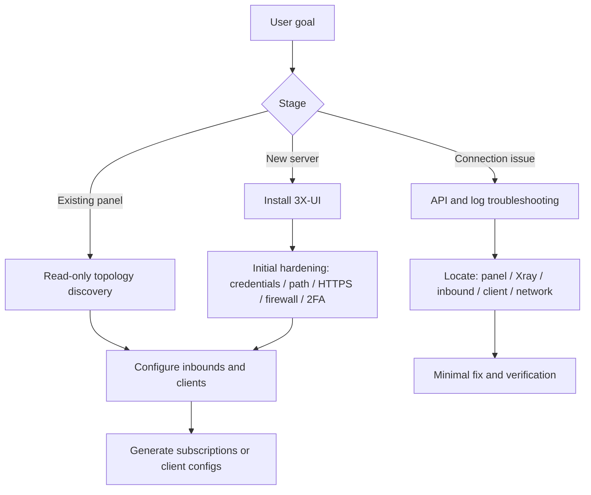
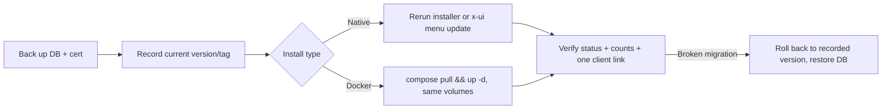
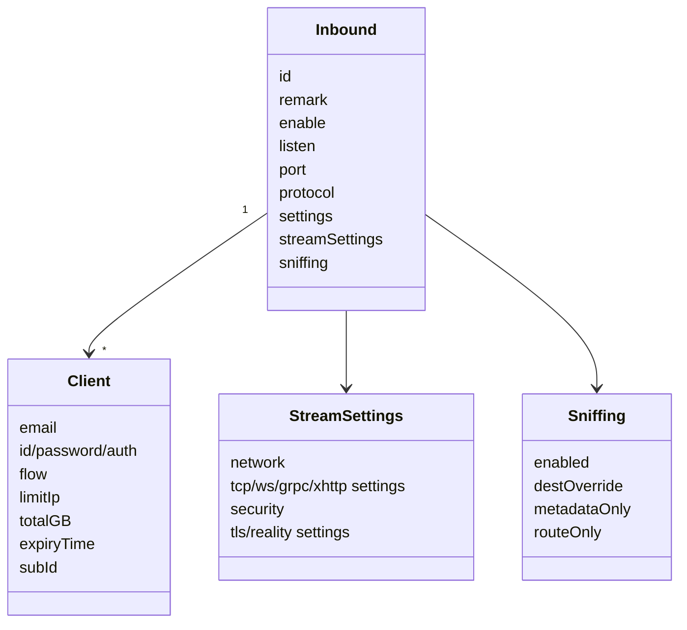
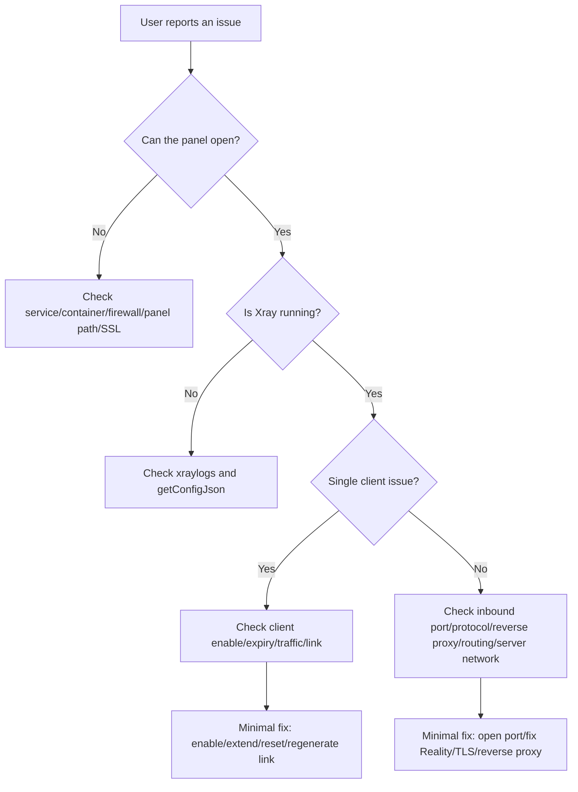

# 3x-ui-best-practices

This Skill helps an AI Agent install, harden, configure, and troubleshoot 3X-UI from scratch. It covers 3X-UI panel installation, inbound rules, clients, subscriptions, Bearer API usage, logs, and common diagnostics.

## Contents

- [Design Principles](#design-principles)
- [Fresh Installation](#fresh-installation)
- [Backup and Restore](#backup-and-restore)
- [Upgrade](#upgrade)
- [API Basics](#api-basics)
- [Inbound Rule Parameters](#inbound-rule-parameters)
- [Recommended Inbound Example](#recommended-inbound-example-vless--tcp--reality--vision)
- [Fallback Example](#fallback-example)
- [Client Configuration](#client-configuration)
- [Subscriptions](#subscriptions)
- [Debugging and Troubleshooting](#debugging-and-troubleshooting)
- [Pre-Change Checklist](#pre-change-checklist)
- [Helper Scripts](#helper-scripts)
- [References](#references)

## Design Principles

- Diagnose with read-only checks first, then propose changes. Deletion, restarts, traffic resets, database imports, and panel updates require explicit confirmation.
- Prefer Bearer Token automation through `/panel/api/*`. Some versions still keep `/panel/setting/*` and `/panel/xray/*` behind login Cookie plus CSRF.
- Use modern nested JSON for inbound and client configuration, not legacy JSON-encoded strings.
- Do not write real API tokens, Reality private keys, client UUID/password/auth values, or `subId` values into documentation or repositories.



## Fresh Installation

### Choose an Installation Mode

| Scenario | Recommended mode | Reason |
| --- | --- | --- |
| Normal Linux VPS, wants the official `x-ui` menu | Official one-line script | Closest to the upstream default flow. After installation, the menu manages service state, certificates, credentials, and firewall tasks. |
| Needs easy backup, migration, and isolated folders | Docker Compose | `db/` and `cert/` are easy to back up, and upgrades are clear. |
| Docker with frequent inbound port changes | Docker `network_mode: host` | Avoids forgetting to publish a new inbound port each time. |
| Many clients or multi-node deployment | PostgreSQL | Better suited than SQLite for high client counts and concurrency. |

### VPS Preparation

```bash
sudo apt-get update
sudo apt-get upgrade -y
sudo apt-get install -y curl ca-certificates
```

Open only the required firewall ports. At minimum, include SSH, the panel port, the subscription port, and every inbound port:

```bash
sudo ufw allow 22/tcp
sudo ufw allow 2053/tcp
sudo ufw allow 443/tcp
sudo ufw enable
sudo ufw status
```

Reason: the 3X-UI panel and Xray inbounds listen separately. Opening only the panel port does not make proxy inbounds reachable.

### Native Installation

```bash
bash <(curl -Ls https://raw.githubusercontent.com/mhsanaei/3x-ui/master/install.sh)
```

After installation, record the random username, password, port, and Web Base Path generated by the installer. You can later run:

```bash
x-ui
```

Use the menu to start or stop the service, view or reset credentials, manage SSL, configure IP Limit/Fail2ban, and manage firewall options.

If GitHub download fails, troubleshoot DNS first. Use IPv4 only when the issue is confirmed to be IPv6 or resolution related:

```bash
bash <(curl -Ls https://raw.githubusercontent.com/mhsanaei/3x-ui/master/install.sh --ipv4)
```

### Docker Compose Installation

`docker-compose.yml`:

```yaml
services:
  3xui:
    image: ghcr.io/mhsanaei/3x-ui:latest
    container_name: 3xui_app
    cap_add:
      - NET_ADMIN
      - NET_RAW
    volumes:
      - ./db/:/etc/x-ui/
      - ./cert/:/root/cert/
    environment:
      XRAY_VMESS_AEAD_FORCED: "false"
      XUI_ENABLE_FAIL2BAN: "true"
    ports:
      - "2053:2053"
      - "443:443"
      - "10882:10882"
    restart: unless-stopped
```

Start it:

```bash
docker compose up -d
docker compose logs -f 3xui
```

Why this is written this way:

- `./db:/etc/x-ui` persists the SQLite database for backup.
- `./cert:/root/cert` persists panel or inbound certificates.
- `NET_ADMIN` and `NET_RAW` allow the bundled Fail2ban to actually write iptables/ip6tables rules. Without them, bans may be logged but not enforced.
- `ports` must list the panel, subscription, and each inbound port. Otherwise an inbound can be open inside the container but unreachable externally.

If you need every port exposed automatically, use:

```yaml
network_mode: host
```

### Post-Install Hardening

1. Change the default or installer-generated admin password.
2. Set a non-obvious Web Base Path, for example `/console-<random>/`.
3. Enable HTTPS for the panel, preferably with a real domain certificate.
4. Enable 2FA when practical.
5. Allow the panel port only from trusted admin IPs.
6. If `limitIp` will be used, install and enable Fail2ban and set the Xray access log to `./access.log`.
7. Create an API Token. Future automation should use Bearer Token auth, not the admin password.

## Backup and Restore

Back up before every upgrade, migration, or risky write. Panel, Xray, certificate, and service changes should always be reversible.

What to back up:

- SQLite database: `/etc/x-ui/x-ui.db` for native installs, or the `./db/` volume for Docker. It holds inbounds, clients, settings, and traffic stats.
- Certificates: `./cert/` for Docker, or the configured certificate path for native installs.
- The web base path, panel port, and credentials, stored separately as secrets (never in this repository).

How to back up:

```bash
# Native: stop for a consistent copy, then restart.
x-ui stop
cp /etc/x-ui/x-ui.db /root/x-ui-backup-$(date +%F).db
x-ui start

# Docker: archive the mounted volumes.
docker compose stop
tar czf xui-backup-$(date +%F).tgz ./db ./cert
docker compose start
```

The `x-ui` menu and the Telegram bot can also produce backups. Restoring a database overwrites current data and is high-risk: confirm before using `/panel/api/server/importDB` or a menu restore, and verify inbound/client counts afterward.

## Upgrade



1. Back up the database and certificates first.
2. Record the current version (panel footer or `/panel/api/server/status`) and, for Docker, the current image tag, so you can roll back.
3. Native: rerun the official installer, or use the `x-ui` menu update entry. Docker: `docker compose pull && docker compose up -d`, reusing the same `./db/` and `./cert/` volumes.
4. Verify: panel login, `/panel/api/server/status`, unchanged inbound/client counts, and one working client link.
5. If a migration misbehaves (for example, traffic stuck at 0 after upgrade), check `getConfigJson` and Xray logs; if needed, roll back to the recorded version and restore the database backup.

## API Basics

```bash
export XUI_BASE='https://your-panel.example.com/console'
export XUI_API_TOKEN='replace-with-api-token'

curl -fsS -H "Authorization: Bearer ${XUI_API_TOKEN}" \
  "${XUI_BASE}/panel/api/inbounds/options"
```

Recommended read-only discovery order:

```bash
curl -fsS -H "Authorization: Bearer ${XUI_API_TOKEN}" \
  "${XUI_BASE}/panel/api/server/status"

curl -fsS -H "Authorization: Bearer ${XUI_API_TOKEN}" \
  "${XUI_BASE}/panel/api/inbounds/list/slim"

curl -fsS -H "Authorization: Bearer ${XUI_API_TOKEN}" \
  "${XUI_BASE}/panel/api/clients/list/paged?page=1&pageSize=25"
```

## Inbound Rule Parameters

### Inbound Object Model



### Top-Level Fields

| Field | Type | Configuration guidance |
| --- | --- | --- |
| `remark` | string | Include protocol, port, and purpose, for example `vless-reality-443`. |
| `enable` | boolean | Whether the inbound is enabled. Use `/setEnable/{id}` when only toggling this flag. |
| `listen` | string | Public inbounds usually use an empty value. Fallback child inbounds should usually bind to `127.0.0.1`. |
| `port` | integer | Listener port. It must be allowed in the system firewall, cloud firewall, and Docker port mapping. |
| `protocol` | enum | `vless`, `vmess`, `trojan`, `shadowsocks`, `wireguard`, `hysteria`, `http`, `mixed`, `tunnel`, `tun`. |
| `expiryTime` | integer | Inbound expiry time. `0` means no expiry. |
| `total` | integer | Inbound traffic quota in bytes. `0` means unlimited. |
| `trafficReset` | enum | `never`, `hourly`, `daily`, `weekly`, `monthly`. |
| `settings` | object | Protocol parameters and client array. |
| `streamSettings` | object | Transport and security parameters. It can be empty for HTTP, Mixed, TUN, and similar protocols. |
| `tag` | string | Unique Xray tag. Do not change it accidentally on update. |
| `sniffing` | object | Domain sniffing. Common values include `http` and `tls`. |
| `nodeId` | integer/null | Binds the inbound to a remote node in multi-node deployments. |

### Protocol `settings`

| Protocol | Required or common fields | Why |
| --- | --- | --- |
| `vless` | `clients[]`, `decryption:"none"`, `encryption:"none"`, `fallbacks[]`, optional `testseed[4]` | Standard VLESS inbound settings. VLESS is commonly used with REALITY and Vision. |
| `vmess` | `clients[]`, with client `id` and `security` | Compatible with older clients. `security` defaults to `auto`. |
| `trojan` | `clients[]`, with client `password`, optional `fallbacks[]` | Password-based TLS-like authentication. Fallbacks are often used for 443 reuse. |
| `shadowsocks` | `method`, `password`, `network`, `clients[]`, `ivCheck` | 2022 methods can support multiple users, and password length must match the method. |
| `hysteria` | `version`, `clients[]`, with client `auth` | Hysteria uses auth tokens, not UUIDs. |
| `wireguard` | `secretKey`, `peers[]`, `mtu`, `noKernelTun` | Peer-based model with no 3X-UI billable client array. |
| `http` | `accounts[]`, `allowTransparent` | Classic HTTP proxy accounts, not part of the 3X-UI client traffic model. |
| `mixed` | `auth`, `accounts[]`, `udp`, `ip` | Combined SOCKS/HTTP inbound. |
| `tunnel` | `rewriteAddress`, `rewritePort`, `portMap`, `allowedNetwork`, `followRedirect` | Dokodemo-door style transparent forwarding. |
| `tun` | `name`, `mtu`, `gateway[]`, `dns[]`, `userLevel`, `autoSystemRoutingTable[]`, `autoOutboundsInterface` | TUN device inbound. |

### `streamSettings`

| Category | Fields | Description |
| --- | --- | --- |
| `network` | `tcp`, `kcp`, `ws`, `grpc`, `httpupgrade`, `xhttp`, `hysteria` | Choose exactly one network branch. |
| `tcpSettings` | `acceptProxyProtocol`, `header` | For REALITY/Vision, prefer `header.type:"none"`. |
| `wsSettings` | `acceptProxyProtocol`, `path`, `host`, `headers`, `heartbeatPeriod` | Useful for CDN or reverse-proxy path routing. |
| `grpcSettings` | `serviceName`, `authority`, `multiMode` | Useful behind HTTP/2/gRPC reverse proxies. |
| `httpupgradeSettings` | `acceptProxyProtocol`, `path`, `host`, `headers` | HTTP Upgrade transport. |
| `xhttpSettings` | `path`, `host`, `mode`, padding/session/xmux fields | Newer XHTTP transport. It has many fields; keep defaults unless client compatibility requires changes. |
| `security` | `none`, `tls`, `reality` | Choose exactly one security branch. |
| `tlsSettings` | SNI, TLS versions, certs, ALPN, fingerprint, ECH | Use for CDN/reverse proxy or real-certificate inbounds. |
| `realitySettings` | `target`, `serverNames[]`, `privateKey`, `settings.publicKey`, `shortIds[]`, `fingerprint`, `spiderX` | Direct-server TLS camouflage. Do not place REALITY behind a CDN. |
| `sockopt` | Advanced socket options | Do not change unless necessary. |
| `externalProxy` / `finalmask` | Extra share-link generation or advanced masking | Preserve existing values unless explicitly configuring them. |

### `sniffing`

Recommended default:

```json
{
  "enabled": true,
  "destOverride": ["http", "tls"],
  "metadataOnly": false,
  "routeOnly": false,
  "ipsExcluded": [],
  "domainsExcluded": []
}
```

Reason: `http` and `tls` let Xray detect domain names from connections, which helps routing and statistics. Add `quic` or `fakedns` only when explicitly needed.

## Recommended Inbound Example: VLESS + TCP + REALITY + Vision

Use this when a public server is directly reachable on 443 and is not behind a CDN or reverse proxy. The upstream FAQ also recommends TCP REALITY Vision as a common Reality combination.

Generate Reality keys first:

```bash
curl -fsS -H "Authorization: Bearer ${XUI_API_TOKEN}" \
  "${XUI_BASE}/panel/api/server/getNewX25519Cert"
```

Create inbound payload:

```json
{
  "enable": true,
  "remark": "vless-reality-443",
  "listen": "",
  "port": 443,
  "protocol": "vless",
  "expiryTime": 0,
  "total": 0,
  "trafficReset": "never",
  "settings": {
    "clients": [],
    "decryption": "none",
    "encryption": "none",
    "fallbacks": []
  },
  "streamSettings": {
    "network": "tcp",
    "tcpSettings": {
      "acceptProxyProtocol": false,
      "header": { "type": "none" }
    },
    "security": "reality",
    "realitySettings": {
      "show": false,
      "xver": 0,
      "target": "www.yahoo.com:443",
      "serverNames": ["www.yahoo.com"],
      "privateKey": "<generated-private-key>",
      "minClientVer": "",
      "maxClientVer": "",
      "maxTimediff": 0,
      "shortIds": ["<random-hex-short-id>"],
      "mldsa65Seed": "",
      "settings": {
        "publicKey": "<generated-public-key>",
        "fingerprint": "chrome",
        "serverName": "",
        "spiderX": "/",
        "mldsa65Verify": ""
      }
    }
  },
  "sniffing": {
    "enabled": true,
    "destOverride": ["http", "tls"],
    "metadataOnly": false,
    "routeOnly": false,
    "ipsExcluded": [],
    "domainsExcluded": []
  }
}
```

Call the API:

```bash
curl -fsS -X POST \
  -H "Authorization: Bearer ${XUI_API_TOKEN}" \
  -H "Content-Type: application/json" \
  --data @vless-reality-443.json \
  "${XUI_BASE}/panel/api/inbounds/add"
```

Key explanations:

- `target` and `serverNames` should look like a real TLS site, usually a domain with TLS 1.3/H2 support.
- `privateKey` belongs only on the server. Clients only need `publicKey`.
- `shortIds` are Reality short IDs. Clients use one of them.
- `flow` is configured on the VLESS client, not on the inbound top level.
- `settings.encryption:"none"` is the normal VLESS value. If using the newer 3X-UI VLESS auth generation feature, configure the returned panel value instead.

## Fallback Example

Use this when one 443 master inbound routes to child inbounds by path or ALPN.

```json
{
  "fallbacks": [
    {
      "childId": 11,
      "path": "/vlws",
      "xver": 2
    },
    {
      "childId": 12,
      "alpn": "h2",
      "dest": "127.0.0.1:8443",
      "xver": 0
    }
  ]
}
```

Reason: 3X-UI/Xray only actually uses fallbacks on a VLESS/Trojan + TCP + TLS/REALITY master inbound. Child inbounds usually listen on localhost to reduce exposure.

## Client Configuration

### 3X-UI Client Fields

| Field | Applies to | Description |
| --- | --- | --- |
| `email` | all 3X-UI managed clients | Unique identifier. It cannot contain spaces, slash, backslash, or control characters. |
| `id` | VLESS/VMess | UUID. It can be omitted with `/clients/add`; the server will generate it. |
| `password` | Trojan/Shadowsocks | Secret. It can be omitted with `/clients/add`; the server will generate it or generate a method-specific key. |
| `auth` | Hysteria | Auth token. The server can generate it. |
| `security` | VMess | `auto`, `aes-128-gcm`, `chacha20-poly1305`, `none`, `zero`. |
| `flow` | VLESS/Trojan TCP TLS/REALITY | `xtls-rprx-vision` or empty. Set it only when the target inbound has `tlsFlowCapable=true`. |
| `subId` | subscriptions | Can be omitted and generated by the server. Do not disclose it. |
| `limitIp` | connection control | `0` disables the limit. Enforcement requires Fail2ban and access logs. |
| `totalGB` | traffic | The API actually uses bytes. `53687091200` is 50 GiB; `0` means unlimited. |
| `expiryTime` | expiry | Unix timestamp in milliseconds. `0` never expires. |
| `enable` | enabled state | When false, the client will not enter the runtime config. |
| `tgId` | Telegram | `0` means unbound. |
| `group` | management | Optional group label. |
| `comment` | notes | Operator note. |
| `reset` | auto reset | Number of days. `0` disables it. |

### Add a Client Through the API

```json
{
  "client": {
    "email": "alice@example.test",
    "flow": "xtls-rprx-vision",
    "totalGB": 53687091200,
    "expiryTime": 0,
    "limitIp": 2,
    "tgId": 0,
    "comment": "50 GiB, no expiry",
    "enable": true
  },
  "inboundIds": [1]
}
```

Call the API:

```bash
curl -fsS -X POST \
  -H "Authorization: Bearer ${XUI_API_TOKEN}" \
  -H "Content-Type: application/json" \
  --data @client-alice.json \
  "${XUI_BASE}/panel/api/clients/add"
```

Reason: letting the 3X-UI server generate UUID and `subId` avoids conflicts with existing data. The client API also synchronizes the `clients` table, the `client_inbounds` relation, and each inbound's `settings.clients[]`.

### Client App Parameters: VLESS REALITY

| Client field | Source |
| --- | --- |
| Address / Server | Panel domain or server IP. |
| Port | Inbound `port`, for example `443`. |
| UUID | 3X-UI client `id`. |
| Encryption | `settings.encryption`, usually `none`. |
| Flow | Client `flow`, for example `xtls-rprx-vision`. |
| Network | `streamSettings.network`, for example `tcp`. |
| Security | `reality`. |
| SNI / Server Name | One value from `realitySettings.serverNames[]`. |
| Public Key / pbk | `realitySettings.settings.publicKey`. |
| Short ID / sid | One value from `realitySettings.shortIds[]`. |
| Fingerprint / fp | `realitySettings.settings.fingerprint`, commonly `chrome`. |
| SpiderX / spx | `realitySettings.settings.spiderX`; 3X-UI may randomize this when generating share links. |
| Allow insecure | false. |

Mihomo/Clash Meta example:

```yaml
proxies:
  - name: alice-vless-reality
    type: vless
    server: your-panel.example.com
    port: 443
    uuid: 11111111-2222-4333-8444-555555555555
    network: tcp
    tls: true
    udp: true
    flow: xtls-rprx-vision
    servername: www.yahoo.com
    client-fingerprint: chrome
    reality-opts:
      public-key: "<generated-public-key>"
      short-id: "<random-hex-short-id>"
```

VLESS URL shape:

```text
vless://<uuid>@your-panel.example.com:443?type=tcp&security=reality&encryption=none&flow=xtls-rprx-vision&sni=www.yahoo.com&fp=chrome&pbk=<public-key>&sid=<short-id>&spx=%2F#alice-vless-reality
```

Prefer generating links through the panel/API to avoid manual mistakes:

```bash
curl -fsS -H "Authorization: Bearer ${XUI_API_TOKEN}" \
  "${XUI_BASE}/panel/api/clients/links/alice%40example.test"
```

## Subscriptions

Subscriptions are useful for long-lived users. After inbound settings change, clients can refresh the subscription to receive the new configuration.

Check the following:

- Subscription Service is enabled in panel settings.
- The subscription port is open in the firewall and Docker port mapping.
- The client `subId` exists and has not been disclosed.
- The client has `enable=true`, has not expired, and has not exhausted its traffic quota.

API verification:

```bash
curl -fsS -H "Authorization: Bearer ${XUI_API_TOKEN}" \
  "${XUI_BASE}/panel/api/clients/subLinks/<subId>"
```

## Debugging and Troubleshooting



Read-only diagnostic commands:

```bash
curl -fsS -H "Authorization: Bearer ${XUI_API_TOKEN}" \
  "${XUI_BASE}/panel/api/server/status"

curl -fsS -X POST -H "Authorization: Bearer ${XUI_API_TOKEN}" \
  "${XUI_BASE}/panel/api/server/xraylogs/100"

curl -fsS -H "Authorization: Bearer ${XUI_API_TOKEN}" \
  "${XUI_BASE}/panel/api/server/getConfigJson"

curl -fsS -H "Authorization: Bearer ${XUI_API_TOKEN}" \
  "${XUI_BASE}/panel/api/inbounds/list/slim"

curl -fsS -H "Authorization: Bearer ${XUI_API_TOKEN}" \
  "${XUI_BASE}/panel/api/clients/traffic/alice%40example.test"

curl -fsS -X POST -H "Authorization: Bearer ${XUI_API_TOKEN}" \
  "${XUI_BASE}/panel/api/clients/onlines"
```

Common issues:

| Issue | Focus checks | Fix |
| --- | --- | --- |
| Inbound configured in Docker but unreachable externally | Whether `ports` publishes the inbound port | Add mappings such as `443:443`, or use host networking. |
| Reality client fails | SNI, public key, shortId, fingerprint, flow, whether a CDN is in front | Regenerate the link with `/clients/links/:email`; do not place Reality behind a CDN. |
| Traffic always stays at 0 | Xray config error, missing client email, API routing rule order, old version after migration | Check `getConfigJson` and logs; update panel or reset the default template and save again if needed. |
| IP limit does not work | Fail2ban, `./access.log`, Docker capabilities, real IP through CDN/tunnel | Enable access log; add `NET_ADMIN/NET_RAW` for Docker; forward the real IP through reverse proxy. |
| Subscription unavailable | Subscription service, port, path, `subId`, client state | Use `/clients/subLinks/:subId` to verify API-level link generation. |
| Panel brute-force attempts | Exposed panel port/path, no 2FA | Change port and path, restrict admin IPs, enable HTTPS and 2FA. |
| Disk is full | Large access log or error log | Disable access log if IP limit is unused, or add log rotation/cleanup. |
| `database is locked` | SQLite + slow disk + frequent log writes | Reduce log writes first; migrate to PostgreSQL for larger scale. |
| Some sites return 403 or do not open | Exit IP is restricted | Configure WARP/Nord/routing rules as needed; do not blindly route everything. |

## Pre-Change Checklist

- Database has been backed up.
- Target port conflicts have been checked.
- Cloud firewall, system firewall, and Docker port mappings are consistent.
- No live secret will be written to a repository or chat log.
- The write payload has been confirmed by the user.
- There are verification commands and a rollback path after the write.

## Helper Scripts

The `scripts/` directory contains offline helpers that need no network or panel access, so they run on any surface and are safe to use while drafting a change. They complement, but never replace, presenting each payload and command to the user for confirmation.

- `validate_config.py` — validate an inbound or client-add payload before you POST it: port range, VLESS `decryption`/`encryption`, XTLS-Vision gating, REALITY-behind-CDN, and common unit mistakes (bytes vs GiB, milliseconds vs seconds). The exit code is the number of errors.
- `parse_share_link.py` — decode a VLESS/VMess/Trojan share link into normalized fields to compare against an inbound. The credential is masked by default, so the output is safe to share.

```bash
# Validate a payload before writing it (exit code = error count).
python scripts/validate_config.py vless-reality-443.json
cat client-alice.json | python scripts/validate_config.py -

# Decode a share link with the credential masked.
python scripts/parse_share_link.py 'vless://...#alice-node'

# Confirm a helper works.
python scripts/validate_config.py --self-test
```

Network-calling scripts are intentionally omitted: some surfaces have no network, and hiding live API calls would undercut the show-then-confirm workflow.

## References

- MHSanaei/3x-ui GitHub repository and Wiki.
- 3X-UI Panel OpenAPI: `/panel/api/openapi.json`.
- Anthropic Agent Skills specification: a Skill directory uses `SKILL.md`, YAML frontmatter contains `name` and `description`, and extra resources are loaded progressively as needed.
