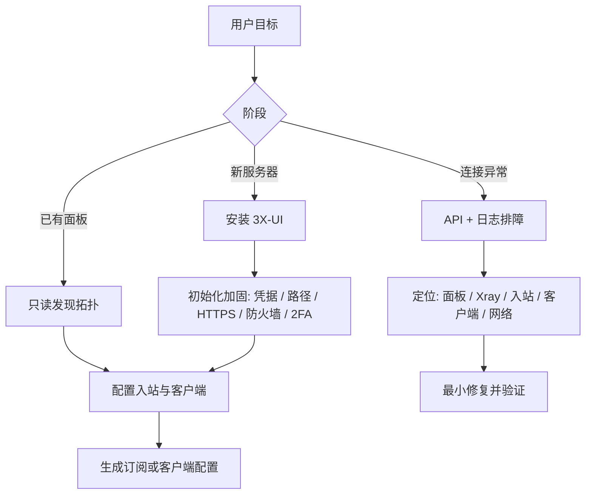
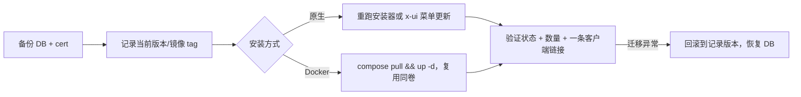
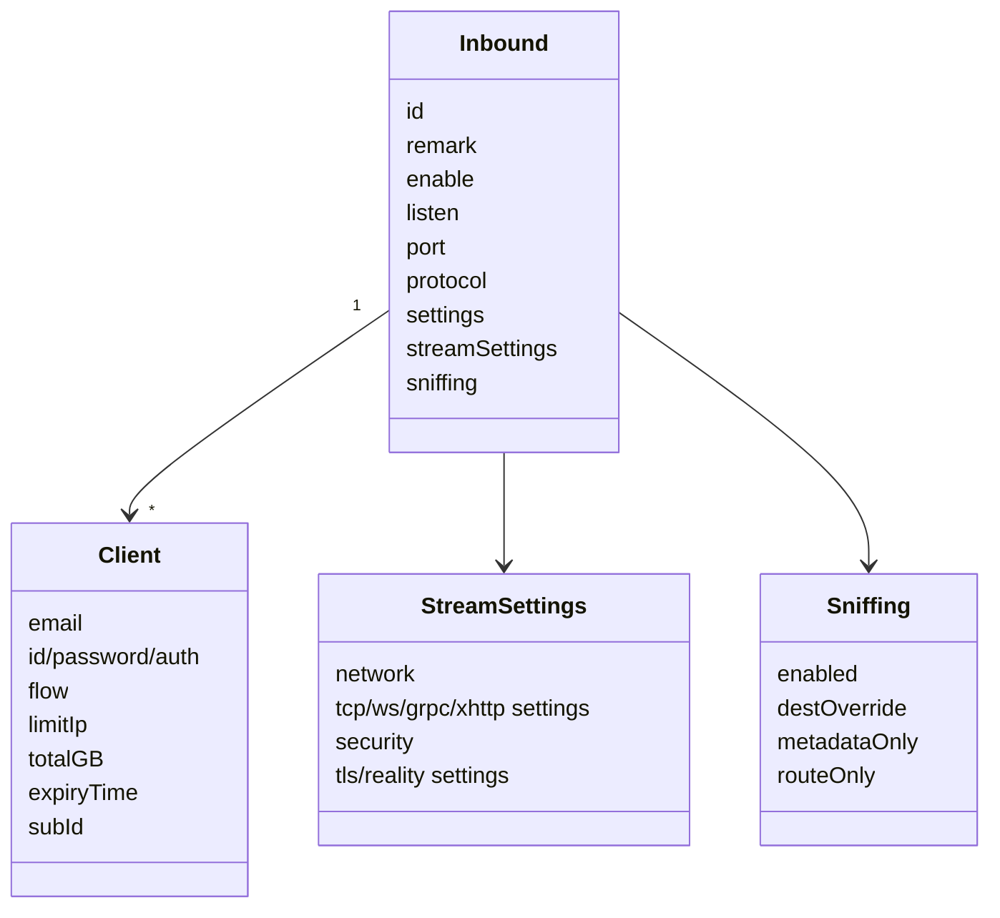
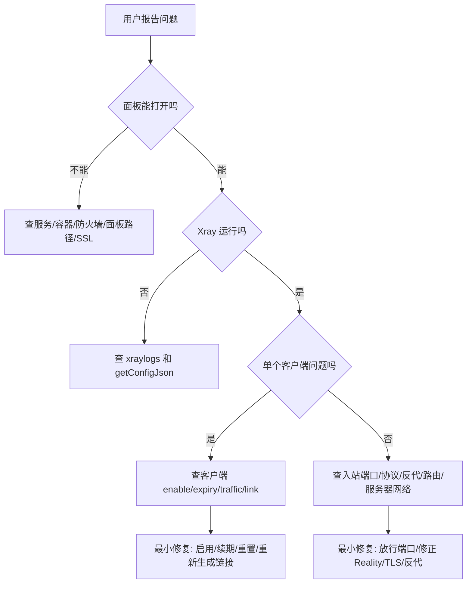

# 3x-ui-best-practices

这个 Skill 用于帮助 AI Agent 从零安装、加固、配置和排查 3X-UI。它覆盖 3X-UI 面板安装、入站规则、客户端、订阅、Bearer API、日志和常见故障诊断。

## 目录

- [设计原则](#设计原则)
- [从零安装](#从零安装)
- [备份与恢复](#备份与恢复)
- [升级](#升级)
- [API 基础](#api-基础)
- [入站规则参数](#入站规则参数)
- [推荐入站示例](#推荐入站示例vless--tcp--reality--vision)
- [fallback 示例](#fallback-示例)
- [客户端配置](#客户端配置)
- [订阅](#订阅)
- [调试与排障](#调试与排障)
- [变更前检查清单](#变更前检查清单)
- [辅助脚本](#辅助脚本)
- [参考资料](#参考资料)

## 设计原则

- 先只读诊断，再提出变更。删除、重启、重置流量、导入数据库、更新面板都必须得到明确确认。
- 优先使用 `/panel/api/*` 的 Bearer Token 接口做自动化。某些版本的 `/panel/setting/*` 和 `/panel/xray/*` 仍需要登录 Cookie + CSRF。
- 入站和客户端配置使用现代嵌套 JSON，不使用旧式 JSON 字符串。
- 不把真实 API Token、Reality 私钥、客户端 UUID/password/auth、subId 写进文档或仓库。



## 从零安装

### 选择安装方式

| 场景 | 推荐方式 | 原因 |
| --- | --- | --- |
| 普通 Linux VPS，想使用官方 `x-ui` 菜单 | 官方一行脚本 | 最贴近上游默认流程，安装后可用菜单管理服务、证书、凭据和防火墙。 |
| 需要易备份、易迁移、隔离目录 | Docker Compose | `db/` 和 `cert/` 可直接备份，升级也清晰。 |
| Docker 且会频繁增加入站端口 | Docker `network_mode: host` | 避免每次新增入站都忘记发布端口。 |
| 大量客户端或多节点 | PostgreSQL | 比 SQLite 更适合高并发和高客户端数量。 |

### VPS 基础准备

```bash
sudo apt-get update
sudo apt-get upgrade -y
sudo apt-get install -y curl ca-certificates
```

防火墙只开放必要端口。至少包括 SSH、面板端口、订阅端口和所有入站端口：

```bash
sudo ufw allow 22/tcp
sudo ufw allow 2053/tcp
sudo ufw allow 443/tcp
sudo ufw enable
sudo ufw status
```

为什么：3X-UI 面板本身和 Xray 入站是不同监听；只开放面板端口不能让代理入站可用。

### 原生安装

```bash
bash <(curl -Ls https://raw.githubusercontent.com/mhsanaei/3x-ui/master/install.sh)
```

安装后记录安装器生成的随机用户名、密码、端口和 Web Base Path。之后可运行：

```bash
x-ui
```

用菜单管理启动/停止服务、查看或重置凭据、管理 SSL、配置 IP Limit/Fail2ban、防火墙等。

如果 GitHub 下载失败，先排查 DNS；只在确认是 IPv6/解析问题时使用：

```bash
bash <(curl -Ls https://raw.githubusercontent.com/mhsanaei/3x-ui/master/install.sh --ipv4)
```

### Docker Compose 安装

`docker-compose.yml`：

```yaml
services:
  3xui:
    image: ghcr.io/mhsanaei/3x-ui:latest
    container_name: 3xui_app
    cap_add:
      - NET_ADMIN
      - NET_RAW
    volumes:
      - ./db/:/etc/x-ui/
      - ./cert/:/root/cert/
    environment:
      XRAY_VMESS_AEAD_FORCED: "false"
      XUI_ENABLE_FAIL2BAN: "true"
    ports:
      - "2053:2053"
      - "443:443"
      - "10882:10882"
    restart: unless-stopped
```

启动：

```bash
docker compose up -d
docker compose logs -f 3xui
```

为什么这么写：

- `./db:/etc/x-ui` 保存 SQLite 数据库，便于备份。
- `./cert:/root/cert` 保存面板或入站证书。
- `NET_ADMIN` 和 `NET_RAW` 让容器内 Fail2ban 能实际写入 iptables/ip6tables；否则可能只记录封禁但不生效。
- `ports` 必须列出面板、订阅和每个入站端口；否则容器内入站开了，外部也连不上。

如果需要自动暴露所有端口，可改用：

```yaml
network_mode: host
```

### 安装后加固

1. 修改默认或安装器生成的管理员密码。
2. 设置不易猜的 Web Base Path，例如 `/console-<random>/`。
3. 为面板启用 HTTPS，优先使用真实域名证书。
4. 可用时开启 2FA。
5. 只允许可信 IP 访问面板端口。
6. 如果要使用 `limitIp`，安装并启用 Fail2ban，并把 Xray access log 设置为 `./access.log`。
7. 创建 API Token，后续自动化只使用 Bearer Token，不使用管理员密码。

## 备份与恢复

每次升级、迁移或有风险的写入之前都要先备份。面板、Xray、证书和系统服务的变更都应可回滚。

备份对象：

- SQLite 数据库：原生安装为 `/etc/x-ui/x-ui.db`，Docker 为 `./db/` 卷。它保存入站、客户端、设置和流量统计。
- 证书：Docker 为 `./cert/`，原生安装为配置的证书路径。
- Web Base Path、面板端口和凭据，作为密钥单独保存（绝不写入本仓库）。

如何备份：

```bash
# 原生：停服以获得一致快照，再启动。
x-ui stop
cp /etc/x-ui/x-ui.db /root/x-ui-backup-$(date +%F).db
x-ui start

# Docker：打包挂载卷。
docker compose stop
tar czf xui-backup-$(date +%F).tgz ./db ./cert
docker compose start
```

`x-ui` 菜单和 Telegram bot 也能生成备份。恢复数据库会覆盖现有数据，属于高危操作：使用 `/panel/api/server/importDB` 或菜单恢复前先确认，恢复后核对入站/客户端数量。

## 升级



1. 先备份数据库和证书。
2. 记录当前版本（面板页脚或 `/panel/api/server/status`），Docker 还要记录当前镜像 tag，便于回滚。
3. 原生：重跑官方安装器，或用 `x-ui` 菜单更新。Docker：`docker compose pull && docker compose up -d`，复用同样的 `./db/` 和 `./cert/` 卷。
4. 验证：面板登录、`/panel/api/server/status`、入站/客户端数量不变、一条可用的客户端链接。
5. 如果迁移异常（例如升级后流量一直是 0），查 `getConfigJson` 和 Xray 日志；必要时回滚到记录的版本并恢复数据库备份。

## API 基础

```bash
export XUI_BASE='https://your-panel.example.com/console'
export XUI_API_TOKEN='replace-with-api-token'

curl -fsS -H "Authorization: Bearer ${XUI_API_TOKEN}" \
  "${XUI_BASE}/panel/api/inbounds/options"
```

推荐只读发现顺序：

```bash
curl -fsS -H "Authorization: Bearer ${XUI_API_TOKEN}" \
  "${XUI_BASE}/panel/api/server/status"

curl -fsS -H "Authorization: Bearer ${XUI_API_TOKEN}" \
  "${XUI_BASE}/panel/api/inbounds/list/slim"

curl -fsS -H "Authorization: Bearer ${XUI_API_TOKEN}" \
  "${XUI_BASE}/panel/api/clients/list/paged?page=1&pageSize=25"
```

## 入站规则参数

### 入站对象关系



### 顶层参数

| 参数 | 类型 | 配置建议 |
| --- | --- | --- |
| `remark` | string | 写清协议、端口和用途，例如 `vless-reality-443`。 |
| `enable` | boolean | 是否启用；仅切换启用状态时用 `/setEnable/{id}`。 |
| `listen` | string | 公网入站通常为空；fallback 子入站建议 `127.0.0.1`。 |
| `port` | integer | 监听端口，需同时放行系统/云防火墙/Docker 端口。 |
| `protocol` | enum | `vless`, `vmess`, `trojan`, `shadowsocks`, `wireguard`, `hysteria`, `http`, `mixed`, `tunnel`, `tun`。 |
| `expiryTime` | integer | 入站过期时间；`0` 表示不过期。 |
| `total` | integer | 入站总流量字节数；`0` 表示不限。 |
| `trafficReset` | enum | `never`, `hourly`, `daily`, `weekly`, `monthly`。 |
| `settings` | object | 协议参数和客户端数组。 |
| `streamSettings` | object | 传输层和安全层参数。HTTP/Mixed/TUN 等可能为空。 |
| `tag` | string | Xray 唯一 tag；更新时不要无意改变。 |
| `sniffing` | object | 域名嗅探；常用 `http`, `tls`。 |
| `nodeId` | integer/null | 多节点场景绑定远端节点。 |

### 协议 settings

| 协议 | 必要/常用参数 | 为什么 |
| --- | --- | --- |
| `vless` | `clients[]`, `decryption:"none"`, `encryption:"none"`, `fallbacks[]`, 可选 `testseed[4]` | VLESS 入站的常规配置；REALITY/Vision 常用这个协议。 |
| `vmess` | `clients[]`，客户端含 `id`, `security` | 兼容旧客户端；`security` 默认 `auto`。 |
| `trojan` | `clients[]`，客户端含 `password`，可有 `fallbacks[]` | 类 TLS 明文密码认证，fallback 常用于复用 443。 |
| `shadowsocks` | `method`, `password`, `network`, `clients[]`, `ivCheck` | 2022 方法可多用户，密码长度需匹配方法。 |
| `hysteria` | `version`, `clients[]`，客户端含 `auth` | Hysteria 使用 auth token，不用 UUID。 |
| `wireguard` | `secretKey`, `peers[]`, `mtu`, `noKernelTun` | Peer 模型，没有 3X-UI 账单客户端数组。 |
| `http` | `accounts[]`, `allowTransparent` | 传统 HTTP 代理账户，不纳入 3X-UI 客户端流量模型。 |
| `mixed` | `auth`, `accounts[]`, `udp`, `ip` | SOCKS/HTTP 混合入站。 |
| `tunnel` | `rewriteAddress`, `rewritePort`, `portMap`, `allowedNetwork`, `followRedirect` | dokodemo-door 风格透明转发。 |
| `tun` | `name`, `mtu`, `gateway[]`, `dns[]`, `userLevel`, `autoSystemRoutingTable[]`, `autoOutboundsInterface` | TUN 设备入站。 |

### streamSettings

| 分类 | 参数 | 说明 |
| --- | --- | --- |
| `network` | `tcp`, `kcp`, `ws`, `grpc`, `httpupgrade`, `xhttp`, `hysteria` | 选择一个网络分支。 |
| `tcpSettings` | `acceptProxyProtocol`, `header` | REALITY/Vision 推荐 `header.type:"none"`。 |
| `wsSettings` | `acceptProxyProtocol`, `path`, `host`, `headers`, `heartbeatPeriod` | 适合 CDN/反代路径转发。 |
| `grpcSettings` | `serviceName`, `authority`, `multiMode` | 适合 HTTP/2/gRPC 反代。 |
| `httpupgradeSettings` | `acceptProxyProtocol`, `path`, `host`, `headers` | HTTP Upgrade 传输。 |
| `xhttpSettings` | `path`, `host`, `mode`, padding/session/xmux 相关参数 | 新式 XHTTP；字段较多，保留默认即可，按客户端兼容性调整。 |
| `security` | `none`, `tls`, `reality` | 选择一个安全分支。 |
| `tlsSettings` | SNI、TLS 版本、证书、ALPN、fingerprint、ECH 等 | CDN/反代或真实证书入站使用。 |
| `realitySettings` | `target`, `serverNames[]`, `privateKey`, `settings.publicKey`, `shortIds[]`, `fingerprint`, `spiderX` | 直连服务器伪装 TLS 目标。不要放在 CDN 后面。 |
| `sockopt` | 高级 socket 参数 | 非必要不改。 |
| `externalProxy` / `finalmask` | 生成额外分享链接或高级掩码 | 保留已有值，按明确需求配置。 |

### sniffing

推荐默认：

```json
{
  "enabled": true,
  "destOverride": ["http", "tls"],
  "metadataOnly": false,
  "routeOnly": false,
  "ipsExcluded": [],
  "domainsExcluded": []
}
```

为什么：`http` 和 `tls` 可让 Xray 从连接里识别域名，便于路由和统计；`quic`/`fakedns` 只有在明确需要时加入。

## 推荐入站示例：VLESS + TCP + REALITY + Vision

适用：公网服务器直连 443，不通过 CDN/反向代理。官方 FAQ 也推荐 TCP REALITY Vision 作为 Reality 常用组合。

先生成 Reality 密钥：

```bash
curl -fsS -H "Authorization: Bearer ${XUI_API_TOKEN}" \
  "${XUI_BASE}/panel/api/server/getNewX25519Cert"
```

创建入站 payload：

```json
{
  "enable": true,
  "remark": "vless-reality-443",
  "listen": "",
  "port": 443,
  "protocol": "vless",
  "expiryTime": 0,
  "total": 0,
  "trafficReset": "never",
  "settings": {
    "clients": [],
    "decryption": "none",
    "encryption": "none",
    "fallbacks": []
  },
  "streamSettings": {
    "network": "tcp",
    "tcpSettings": {
      "acceptProxyProtocol": false,
      "header": { "type": "none" }
    },
    "security": "reality",
    "realitySettings": {
      "show": false,
      "xver": 0,
      "target": "www.yahoo.com:443",
      "serverNames": ["www.yahoo.com"],
      "privateKey": "<generated-private-key>",
      "minClientVer": "",
      "maxClientVer": "",
      "maxTimediff": 0,
      "shortIds": ["<random-hex-short-id>"],
      "mldsa65Seed": "",
      "settings": {
        "publicKey": "<generated-public-key>",
        "fingerprint": "chrome",
        "serverName": "",
        "spiderX": "/",
        "mldsa65Verify": ""
      }
    }
  },
  "sniffing": {
    "enabled": true,
    "destOverride": ["http", "tls"],
    "metadataOnly": false,
    "routeOnly": false,
    "ipsExcluded": [],
    "domainsExcluded": []
  }
}
```

调用：

```bash
curl -fsS -X POST \
  -H "Authorization: Bearer ${XUI_API_TOKEN}" \
  -H "Content-Type: application/json" \
  --data @vless-reality-443.json \
  "${XUI_BASE}/panel/api/inbounds/add"
```

关键解释：

- `target` 和 `serverNames` 要像真实 TLS 站点，通常使用支持 TLS 1.3/H2 的域名。
- `privateKey` 只放服务端；客户端只需要 `publicKey`。
- `shortIds` 是 Reality 短 ID，客户端用其中一个。
- `flow` 不在入站顶层，而在 VLESS 客户端上设置。
- `settings.encryption:"none"` 是 VLESS 常规值；如果使用 3X-UI 新的 VLESS auth 生成能力，再按面板返回值配置。

## fallback 示例

适用：一个 443 主入站根据 path/ALPN 转发到子入站。

```json
{
  "fallbacks": [
    {
      "childId": 11,
      "path": "/vlws",
      "xver": 2
    },
    {
      "childId": 12,
      "alpn": "h2",
      "dest": "127.0.0.1:8443",
      "xver": 0
    }
  ]
}
```

为什么：3X-UI/Xray 只在 VLESS/Trojan + TCP + TLS/REALITY 主入站上真正使用 fallback；子入站通常监听本地地址，减少暴露面。

## 客户端配置

### 3X-UI 客户端字段

| 参数 | 适用协议 | 说明 |
| --- | --- | --- |
| `email` | 全部 3X-UI 受管客户端 | 唯一标识，不能有空格、斜杠、反斜杠或控制字符。 |
| `id` | VLESS/VMess | UUID；通过 `/clients/add` 可省略，由服务端生成。 |
| `password` | Trojan/Shadowsocks | 密钥；通过 `/clients/add` 可省略，由服务端生成或按方法生成。 |
| `auth` | Hysteria | auth token；可由服务端生成。 |
| `security` | VMess | `auto`, `aes-128-gcm`, `chacha20-poly1305`, `none`, `zero`。 |
| `flow` | VLESS/Trojan TCP TLS/REALITY | `xtls-rprx-vision` 或空；只有目标入站 `tlsFlowCapable=true` 时设置。 |
| `subId` | 订阅 | 可省略，由服务端生成；不要公开。 |
| `limitIp` | 连接控制 | `0` 关闭；生效需要 Fail2ban 和 access log。 |
| `totalGB` | 流量 | API 实际使用字节；`53687091200` = 50 GiB；`0` 不限。 |
| `expiryTime` | 到期 | Unix 毫秒时间戳；`0` 永不过期。 |
| `enable` | 启用 | false 时客户端不会进入运行时配置。 |
| `tgId` | Telegram | `0` 表示不绑定。 |
| `group` | 管理 | 可选分组。 |
| `comment` | 备注 | 运营备注。 |
| `reset` | 自动重置 | 天数；`0` 关闭。 |

### 通过 API 添加客户端

```json
{
  "client": {
    "email": "alice@example.test",
    "flow": "xtls-rprx-vision",
    "totalGB": 53687091200,
    "expiryTime": 0,
    "limitIp": 2,
    "tgId": 0,
    "comment": "50 GiB, no expiry",
    "enable": true
  },
  "inboundIds": [1]
}
```

调用：

```bash
curl -fsS -X POST \
  -H "Authorization: Bearer ${XUI_API_TOKEN}" \
  -H "Content-Type: application/json" \
  --data @client-alice.json \
  "${XUI_BASE}/panel/api/clients/add"
```

为什么：让 3X-UI 服务端生成 UUID/subId，避免 Agent 自己生成后与现有数据冲突；用客户端 API 会同步 `clients` 表、`client_inbounds` 关系和每个入站的 `settings.clients[]`。

### 客户端 App 参数：VLESS REALITY

| 客户端字段 | 取值来源 |
| --- | --- |
| Address / Server | 面板域名或服务器 IP。 |
| Port | 入站 `port`，例如 `443`。 |
| UUID | 3X-UI 客户端 `id`。 |
| Encryption | `settings.encryption`，通常 `none`。 |
| Flow | 客户端 `flow`，例如 `xtls-rprx-vision`。 |
| Network | `streamSettings.network`，例如 `tcp`。 |
| Security | `reality`。 |
| SNI / Server Name | `realitySettings.serverNames[]` 中的一个值。 |
| Public Key / pbk | `realitySettings.settings.publicKey`。 |
| Short ID / sid | `realitySettings.shortIds[]` 中的一个值。 |
| Fingerprint / fp | `realitySettings.settings.fingerprint`，常用 `chrome`。 |
| SpiderX / spx | `realitySettings.settings.spiderX`；3X-UI 生成分享链接时可能随机化。 |
| Allow insecure | false。 |

Mihomo/Clash Meta 示例：

```yaml
proxies:
  - name: alice-vless-reality
    type: vless
    server: your-panel.example.com
    port: 443
    uuid: 11111111-2222-4333-8444-555555555555
    network: tcp
    tls: true
    udp: true
    flow: xtls-rprx-vision
    servername: www.yahoo.com
    client-fingerprint: chrome
    reality-opts:
      public-key: "<generated-public-key>"
      short-id: "<random-hex-short-id>"
```

VLESS URL 形态：

```text
vless://<uuid>@your-panel.example.com:443?type=tcp&security=reality&encryption=none&flow=xtls-rprx-vision&sni=www.yahoo.com&fp=chrome&pbk=<public-key>&sid=<short-id>&spx=%2F#alice-vless-reality
```

推荐直接用面板/API 生成链接，避免手动拼错：

```bash
curl -fsS -H "Authorization: Bearer ${XUI_API_TOKEN}" \
  "${XUI_BASE}/panel/api/clients/links/alice%40example.test"
```

## 订阅

订阅适合长期用户：入站参数变化后，客户端刷新订阅即可获得新配置。

需要确认：

- 面板设置中启用 Subscription Service。
- 订阅端口已在防火墙/Docker 发布。
- 客户端 `subId` 存在且未泄露。
- 客户端 `enable=true`，未过期且未用尽流量。

API 验证：

```bash
curl -fsS -H "Authorization: Bearer ${XUI_API_TOKEN}" \
  "${XUI_BASE}/panel/api/clients/subLinks/<subId>"
```

## 调试与排障



只读诊断命令：

```bash
curl -fsS -H "Authorization: Bearer ${XUI_API_TOKEN}" \
  "${XUI_BASE}/panel/api/server/status"

curl -fsS -X POST -H "Authorization: Bearer ${XUI_API_TOKEN}" \
  "${XUI_BASE}/panel/api/server/xraylogs/100"

curl -fsS -H "Authorization: Bearer ${XUI_API_TOKEN}" \
  "${XUI_BASE}/panel/api/server/getConfigJson"

curl -fsS -H "Authorization: Bearer ${XUI_API_TOKEN}" \
  "${XUI_BASE}/panel/api/inbounds/list/slim"

curl -fsS -H "Authorization: Bearer ${XUI_API_TOKEN}" \
  "${XUI_BASE}/panel/api/clients/traffic/alice%40example.test"

curl -fsS -X POST -H "Authorization: Bearer ${XUI_API_TOKEN}" \
  "${XUI_BASE}/panel/api/clients/onlines"
```

常见问题：

| 问题 | 重点排查 | 处理 |
| --- | --- | --- |
| Docker 里配置了入站但外部连不上 | `ports` 是否发布入站端口 | 增加 `443:443` 等端口映射，或使用 host network。 |
| Reality 客户端失败 | SNI、public key、shortId、fingerprint、flow、是否经过 CDN | 用 `/clients/links/:email` 重新生成链接；Reality 不放 CDN 后面。 |
| 流量一直是 0 | Xray 配置错误、客户端 email 缺失、API routing rule 顺序、迁移后版本旧 | 查 `getConfigJson` 和日志；必要时更新面板或重置默认模板后重新保存。 |
| IP 限制不生效 | Fail2ban、`./access.log`、Docker caps、CDN/隧道真实 IP | 开启 access log；Docker 加 `NET_ADMIN/NET_RAW`；反代传真实 IP。 |
| 订阅不可用 | 订阅服务、端口、路径、subId、客户端状态 | 用 `/clients/subLinks/:subId` 验证 API 层是否能生成链接。 |
| 面板被爆破 | 面板端口/路径暴露、无 2FA | 改端口和路径，限制管理 IP，启用 HTTPS 和 2FA。 |
| 磁盘占满 | access log 或 error log 过大 | 不用 IP limit 时可禁用 access log，或做日志轮转/清理。 |
| database is locked | SQLite + 慢磁盘 + 高频日志写入 | 先降日志写入；规模大时迁移 PostgreSQL。 |
| 某些网站 403/打不开 | 出口 IP 被限制 | 按需配置 WARP/Nord/路由规则，不要盲目全局绕路。 |

## 变更前检查清单

- 已备份数据库。
- 已确认目标端口未冲突。
- 已确认云防火墙、系统防火墙、Docker 端口映射一致。
- 已确认不会把 live secret 写入仓库或聊天记录。
- 写入 payload 已由用户确认。
- 写入后有验证命令和回滚路径。

## 辅助脚本

`scripts/` 目录提供离线辅助脚本，不需要网络或面板访问，在任何 surface 上都能运行，适合在起草变更时使用。它们是对「向用户展示每条 payload 和命令并确认」的补充，而非替代。

- `validate_config.py` —— 在 POST 之前校验入站或 client-add payload：端口范围、VLESS 的 `decryption`/`encryption`、XTLS-Vision 适用条件、REALITY 是否被放在 CDN 后，以及常见单位错误（字节 vs GiB、毫秒 vs 秒）。退出码即错误数。
- `parse_share_link.py` —— 把 VLESS/VMess/Trojan 分享链接解析成规范字段，便于和入站对照。凭据默认脱敏，输出可安全分享。

```bash
# 写入前校验 payload（退出码 = 错误数）。
python scripts/validate_config.py vless-reality-443.json
cat client-alice.json | python scripts/validate_config.py -

# 解析分享链接（凭据脱敏）。
python scripts/parse_share_link.py 'vless://...#alice-node'

# 确认脚本可用。
python scripts/validate_config.py --self-test
```

刻意不提供联网脚本：部分 surface 没有网络，而且把实时 API 调用藏进脚本会削弱「先展示再确认」的工作方式。

## 参考资料

- MHSanaei/3x-ui GitHub 仓库和 Wiki。
- 3X-UI Panel OpenAPI：`/panel/api/openapi.json`。
- Anthropic Agent Skills 规范：Skill 目录使用 `SKILL.md`，YAML frontmatter 包含 `name` 与 `description`，其余资源按需渐进加载。
