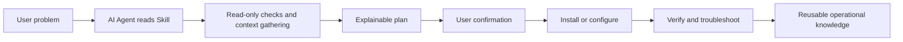

# Cross-Border Network Best Practices

This repository is a collection of AI Agent Skills for cross-border networking and censorship-circumvention practices, designed for ordinary users rather than only network specialists.

The core idea is simple: knowledge that is usually scattered across open-source projects, operations notes, client configuration guides, protocol parameters, and troubleshooting experience can be organized into reusable AI Agent Skills. With those Skills, people without a deep networking background can ask an AI agent to help them understand, install, configure, and debug their own cross-border network access setup.

> Use this project within the boundaries of local law, provider terms, and your own risk model. This repository focuses on open information access, personal connectivity, privacy protection, and technical learning. It does not encourage or support attacks, fraud, abuse, spam, unauthorized access, or other unlawful activity.

## Goals

- Help ordinary users complete networking tasks that are usually considered specialist work.
- Turn "how to install, how to configure, why this setting matters, and how to debug it" into reusable Agent Skills.
- Collect best practices across tools, protocols, clients, panels, servers, and network environments.
- Prefer explainable, verifiable, and reversible workflows over opaque one-click scripts.
- Provide multilingual documentation whenever practical.

## Current Skills

### `3x-ui-best-practices`

Helps AI agents install, harden, configure, and troubleshoot [3X-UI](https://github.com/MHSanaei/3x-ui), including Xray inbound rules, clients, subscriptions, and panel APIs.

This Skill covers:

- 3X-UI installation, upgrade, backup, and baseline hardening.
- Common inbound designs for VLESS, VMess, Trojan, Shadowsocks, and related protocols.
- Transport and security choices such as REALITY, TLS, WebSocket, gRPC, and TCP.
- Client field configuration, share links, and subscription checks.
- Read-only diagnostics and configuration review through the 3X-UI panel API.
- Detailed inbound and client parameter explanations with usable examples.

Entry files:

- [`3x-ui-best-practices/SKILL.md`](./3x-ui-best-practices/SKILL.md)
- [`3x-ui-best-practices/README.md`](./3x-ui-best-practices/README.md)
- [`3x-ui-best-practices/README.zh_CN.md`](./3x-ui-best-practices/README.zh_CN.md)

## Repository Layout

```text
.
├── 3x-ui-best-practices/
│   ├── SKILL.md
│   ├── README.md
│   ├── README.zh_CN.md
│   ├── agents/
│   ├── references/
│   ├── scripts/
│   └── evals/
├── CLAUDE.md
├── LICENSE
├── README.md
└── README.zh_CN.md
```

Each Skill should live in its own directory and should include at least:

- `SKILL.md`: the entrypoint file that follows the AI Agent Skill specification.
- `README.md`: the main English documentation, suitable for broader reuse.
- `README.zh_CN.md`: Chinese documentation for Chinese-speaking users.
- `references/`: longer references, API fields, configuration notes, or troubleshooting manuals.
- `agents/`: optional integration examples for specific agent platforms.
- `scripts/`: optional offline helper scripts (no network) that the agent can run.
- `evals/`: optional scenario rubric for testing the Skill (no built-in runner).

## How To Use

Give this repository, or a specific Skill directory, to an AI agent that supports Skills. Then ask for the task directly. For example:

```text
Use 3x-ui-best-practices to help me install and harden 3X-UI from scratch.
```

```text
Design a VLESS + REALITY inbound for me and explain why each client parameter is configured that way.
```

```text
My client cannot connect. Use the 3X-UI API for read-only diagnostics, and do not modify the configuration.
```

A good agent workflow should look like this:

1. Read the relevant Skill and references first.
2. Perform read-only checks and environment discovery before changing anything.
3. Present the plan, impact, and rollback path before modifying configuration.
4. Treat API tokens, SSH credentials, private keys, UUIDs, short IDs, and similar values as local secrets only.
5. After changes, verify the result with API checks, logs, client configuration review, and connectivity tests.

## Working Principles



Every Skill in this repository should follow these principles:

- **Designed for real users**: documentation should help people without deep networking backgrounds complete real tasks.
- **Explain parameter choices**: provide not only configuration, but also the reason behind each important field.
- **Prefer read-only diagnostics first**: inspect the current state before deciding whether to modify it.
- **Use least privilege**: API tokens, SSH access, firewall permissions, and panel permissions should be scoped to the task.
- **Do not leak secrets**: examples must use placeholders and must not commit real tokens, private keys, UUIDs, REALITY private keys, subscription URLs, or client credentials.
- **Keep changes reversible**: operations involving panels, Xray, certificates, firewalls, or system services should include backups when practical.
- **Avoid abuse**: do not help hide attack origins, bypass authorization, send bulk spam, compromise systems, or evade platform risk controls.

## Planned Skills

Future Skills may cover:

- `xray-core-best-practices`: native Xray configuration, routing, DNS, logging, and performance tuning.
- `sing-box-best-practices`: sing-box server, client, and rule-set practices.
- `mihomo-clash-best-practices`: Mihomo/Clash subscriptions, routing rules, split tunneling, and mobile configuration.
- `vps-network-hardening`: VPS initialization, firewall setup, SSH hardening, security updates, and basic monitoring.
- `domain-tls-reality-guide`: domains, certificates, SNI, REALITY target sites, and camouflage strategy.
- `mobile-client-setup`: iOS, Android, Windows, and macOS client setup and troubleshooting.
- `openwrt-router-proxy`: OpenWrt, transparent proxying, DNS leak prevention, and home network configuration.

## Contribution Guidelines

New Skills are welcome. Please follow these conventions:

1. Use one directory per Skill, named with lowercase English words and hyphens.
2. Keep `SKILL.md` concise. Focus on agent behavior, boundaries, checklists, and references.
3. Put longer documentation, configuration examples, and API field tables in `README.md`, `README.zh_CN.md`, or `references/`.
4. Redact all examples. Use placeholders such as `example.com`, `replace-with-*`, and `00000000-0000-0000-0000-000000000000`.
5. Clearly distinguish read-only operations, configuration-changing operations, and operations that require user confirmation.
6. Make configuration examples complete enough to use, and explain the purpose of every key field.
7. Use Mermaid diagrams, flowcharts, or topology diagrams only when they improve understanding.
8. Follow the Agent Skills spec: `name` ≤64 chars (lowercase letters/numbers/hyphens, matching the directory, no "anthropic"/"claude"); `description` ≤1024 chars stating what it does and when to use it; keep `SKILL.md` under ~500 lines; keep references one level deep; and give any file over ~100 lines a table of contents.

## Disclaimer

Cross-border network access depends on regional law, network conditions, provider rules, and personal security models. This repository provides technical learning material, configuration guidance, and an Agent Skill organization pattern. It is not legal advice and does not guarantee usability in any specific country, network, or provider environment.

Users are responsible for evaluating risk and for their own deployments, configurations, accounts, servers, and network behavior.
