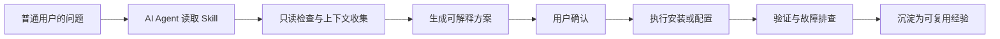

# Cross-Border Network Best Practices

[](README.md) [](README.zh_CN.md)

这是一个面向普通人的跨境网络与翻墙相关 AI Agent Skills 集合。

项目的核心想法很简单：把原本分散在开源项目、运维经验、客户端配置、协议参数和故障排查里的知识，整理成 AI Agent 可以直接使用的 Skills。这样，更多没有系统网络工程背景的人，也可以在 AI 的帮助下理解、安装、配置、调试自己的跨境网络访问能力。

> 请在当地法律、服务商条款和个人风险承受范围内使用本项目。本仓库关注开放信息访问、个人连接能力、隐私保护和技术学习，不鼓励也不支持攻击、欺诈、滥用、垃圾信息、未授权访问或其他违法行为。

## 项目目标

- 让普通用户也能借助 AI 完成原本偏专业的跨境网络配置。
- 把“该怎么装、该怎么配、为什么这样配、出问题怎么查”写成可复用的 Agent Skill。
- 收集不同工具、协议、客户端、面板、服务端和网络环境下的最佳实践。
- 强调可解释、可验证、可回滚，而不是只给一段一键脚本。
- 尽量提供中英文文档，让不同语言环境的用户都能使用。

## 当前 Skills

### `3x-ui-best-practices`

用于帮助 AI Agent 从零安装、加固、配置和排查 [3X-UI](https://github.com/MHSanaei/3x-ui) 面板及其 Xray 入站规则、客户端和 API。

这个 Skill 覆盖：

- 3X-UI 的安装、升级、备份和基础加固。
- VLESS、VMess、Trojan、Shadowsocks 等常见入站规则设计。
- REALITY、TLS、WebSocket、gRPC、TCP 等传输与安全参数选择。
- 客户端字段配置、分享链接和订阅配置检查。
- 通过 3X-UI 面板 API 进行只读诊断、配置核对和故障排查。
- 入站规则、客户端配置参数的详细解释和可用示例。

入口文件：

- [`3x-ui-best-practices/SKILL.md`](./3x-ui-best-practices/SKILL.md)
- [`3x-ui-best-practices/README.md`](./3x-ui-best-practices/README.md)
- [`3x-ui-best-practices/README.zh_CN.md`](./3x-ui-best-practices/README.zh_CN.md)

## 仓库结构

```text
.
├── 3x-ui-best-practices/
│   ├── SKILL.md
│   ├── README.md
│   ├── README.zh_CN.md
│   ├── agents/
│   ├── references/
│   ├── scripts/
│   └── evals/
├── CLAUDE.md
├── LICENSE
├── README.md
└── README.zh_CN.md
```

每个 Skill 应该独立放在自己的目录中，并至少包含：

- `SKILL.md`：符合 AI Agent Skill 规范的入口文件。
- `README.md`：英文主文档，方便跨平台复用。
- `README.zh_CN.md`：中文文档，面向中文用户解释背景、步骤和示例。
- `references/`：较长的参考资料、API 字段、配置说明或排查手册。
- `agents/`：可选，用于不同 Agent 平台的集成示例。
- `scripts/`：可选，agent 可运行的离线辅助脚本（不联网）。
- `evals/`：可选，用于测试 Skill 的场景评测集（无内置运行器）。

## 如何使用

把整个仓库或某个 Skill 目录提供给支持 Skills 的 AI Agent，然后直接提出任务。例如：

```text
使用 3x-ui-best-practices 帮我从零安装并加固 3X-UI。
```

```text
帮我设计一个 VLESS + REALITY 的入站规则，并解释每个客户端参数为什么这样写。
```

```text
我的客户端连不上，请通过 3X-UI API 做只读检查，不要修改配置。
```

建议让 Agent 遵循这样的工作方式：

1. 先读取相关 Skill 和参考文档。
2. 先做只读检查和环境确认。
3. 在修改配置前展示计划、影响范围和回滚方式。
4. 需要密钥、Token、私钥、UUID、短 ID 等敏感信息时，只在本地临时使用，不写入公开文档。
5. 修改后用 API、日志、客户端配置和连通性测试交叉验证结果。

## 工作原则



本项目希望每个 Skill 都遵循这些原则：

- **面向真实用户**：文档要能帮助没有深厚网络背景的人完成任务。
- **解释参数原因**：不要只给配置，还要说明为什么这样配置。
- **优先只读诊断**：排查问题时先看现状，再决定是否修改。
- **最小权限**：API Token、SSH 权限、防火墙权限都应只给完成任务所需的范围。
- **不泄露秘密**：示例中只使用占位符，不能提交真实 Token、私钥、UUID、Reality private key、订阅链接或客户端凭证。
- **可回滚**：涉及面板、Xray、证书、防火墙、系统服务的操作，应尽量先备份。
- **避免滥用**：不帮助隐藏攻击来源、绕过授权、批量滥发、入侵系统或规避平台风控。

## 计划中的 Skills

后续可以继续收集和整理这些方向：

- `xray-core-best-practices`：Xray 原生配置、路由、DNS、日志和性能调优。
- `sing-box-best-practices`：sing-box 服务端、客户端和规则集实践。
- `mihomo-clash-best-practices`：Mihomo/Clash 订阅、规则、分流和移动端配置。
- `vps-network-hardening`：VPS 初始化、防火墙、SSH、安全更新和基础监控。
- `domain-tls-reality-guide`：域名、证书、SNI、REALITY 目标站点与伪装策略。
- `mobile-client-setup`：iOS、Android、Windows、macOS 客户端配置与排错。
- `openwrt-router-proxy`：OpenWrt、透明代理、DNS 防泄漏和家庭网络配置。

## 贡献约定

欢迎继续添加新的 Skill。建议遵循：

1. 一个 Skill 一个目录，目录名使用小写英文和连字符。
2. `SKILL.md` 保持短小，重点写 Agent 行为、边界、检查清单和引用资料。
3. 长文档、配置样例、API 字段表放进 `README.md`、`README.zh_CN.md` 或 `references/`。
4. 示例配置必须脱敏，使用 `example.com`、`replace-with-*`、`00000000-0000-0000-0000-000000000000` 等占位符。
5. 明确标出只读操作、会修改配置的操作、需要用户确认的操作。
6. 配置示例要尽量完整可用，并解释每个关键字段的用途。
7. 如果包含 Mermaid 图、流程图或拓扑图，应服务于理解，不做装饰性堆叠。
8. 遵循 Agent Skills 规范：`name` ≤64 字符（小写字母/数字/连字符，与目录同名，不含 "anthropic"/"claude"）；`description` ≤1024 字符，说明用途和触发时机；`SKILL.md` 控制在约 500 行以内；引用保持一层深度；超过约 100 行的文件加目录。

## 免责声明

跨境网络访问能力受到地区法律、网络环境、服务商规则和个人安全模型影响。本仓库提供的是技术学习、配置说明和 Agent Skill 组织方式，不构成法律意见，也不保证任何特定地区、网络或服务商环境下可用。

使用者应自行判断风险，并对自己的部署、配置、账号、服务器和网络行为负责。

## Star 历史

<a href="https://www.star-history.com/?repos=XKHoshizora%2Fcross-border-network-best-practices&type=date&legend=top-left">
 <picture>
   <source media="(prefers-color-scheme: dark)" srcset="https://api.star-history.com/chart?repos=XKHoshizora/cross-border-network-best-practices&type=date&theme=dark&legend=top-left" />
   <source media="(prefers-color-scheme: light)" srcset="https://api.star-history.com/chart?repos=XKHoshizora/cross-border-network-best-practices&type=date&legend=top-left" />
   
 </picture>
</a>
